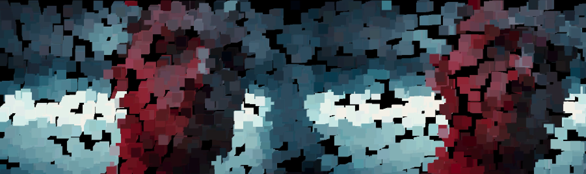
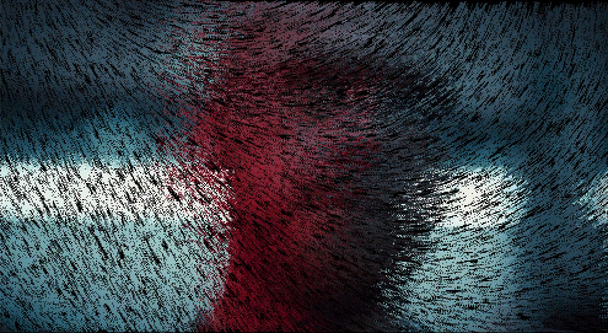

# 11 - PROCESSING & PIXELSORTING

This is an experimental visual made with gifs, perlin noise and audio. We got inspired by the term generative impressionism and created these visuals. 

To make this work, you'll need to download the tool [thinkgearconnector](http://developer.neurosky.com/docs/doku.php?id=thinkgear_connector_tgc). This enables the communication between the two and will return the result in JSON.

You will also have to add the [Thinkgear-Java-Socket](https://github.com/borg/ThinkGear-Java-socket) library to Processing.

