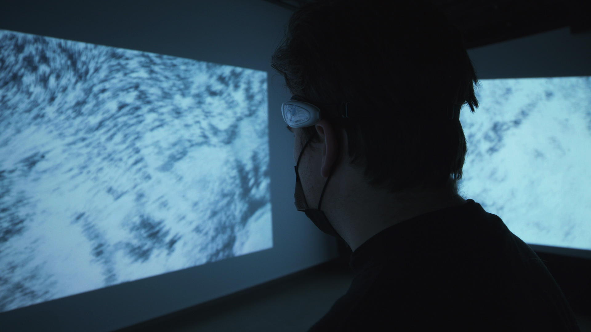

# DE VERDWAALZAAL
"De verdwaalzaal" is an expiremental installation, where a visitor can be immersed in a literary work that is read aloud. By receiving brainwave data from a consumer-grade single-electrode EEG sensor, we measure the excitibility of the user to control visuals and soundscapes. This means the listener influences the room and and vica versa.  
We got inspired by generative impressionism and urbanism to create a mood that corresponds with the snippet we carefully chose from Joost Vandecasteele's "Jungle". 

  

## Calculating excitibility
To measure the excitibility of the listener we applied an algorithm based on Z. Liang et al research. In [Detection of Media Enjoyment using Single Channel EEG](https://ieeexplore.ieee.org/document/7833845) Z. Liang et al, built a predictive model to calculate excitibility with an accuracy of about 80%.

<pre>
Excitibility = 0.574 - 1.951 x high_β - 1.092 x high_β + 1.944 x high_α + 2.511 x low_β + 1.513 x θ
</pre>

You can clearly see that low beta levels have a lot of influence on our excitibility. 
  

## Setup
### Processing
All of this is powered by [Processing](https://processing.org/download/), so you will need to download that. We heavily rely on sound and video, so start with importing the audio and video libraries provided by The Processing Foundation. 
  
### Neurosky Thinkgear Connector 
To be able to have serial communcation between your EEG sensor and Processing you will need a tool called [Thinkgear Connector](http://developer.neurosky.com/docs/doku.php?id=thinkgear_connector_tgc). This will act as a bridge, where the EEG data comes in via Bluetooth and is sent to Processing in JSON format. 
  
For Processing to be able to interpret this data you will need two additional libraries; neurosky and json. You can find those here [Thinkgear-Java-Socket](https://github.com/borg/ThinkGear-Java-socket)
  

### Spout
Finally, to send the render to MadMapper for projectmapping, you will need a library called [Spout](https://spout.zeal.co/). 
