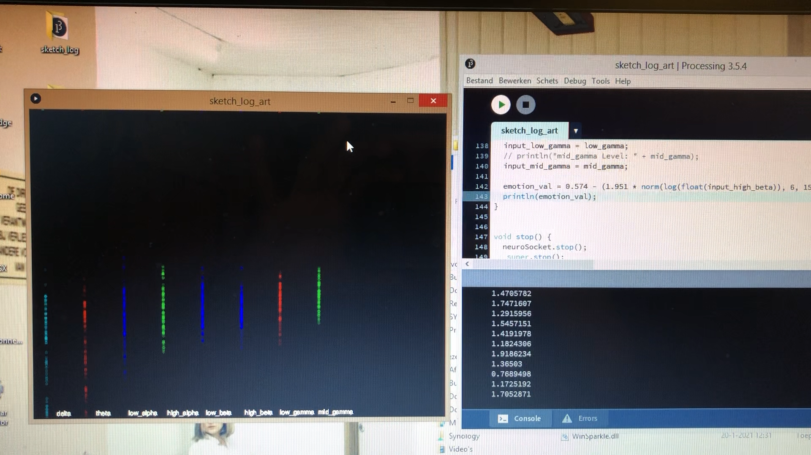

# 9 - PROCESSING & NEUROSKY - PERLIN NOISE

This is a first experimental visual made with perlin noise, based on the algorithm developed by [wangyasai](https://wangyasai.github.io/Perlin-Noise/) with the Memento color scheme. 

To make this work, you'll need to download the tool [thinkgearconnector](http://developer.neurosky.com/docs/doku.php?id=thinkgear_connector_tgc). This enables the communication between the two and will return the result in JSON.

You will also have to add the [Thinkgear-Java-Socket](https://github.com/borg/ThinkGear-Java-socket) library to Processing.

